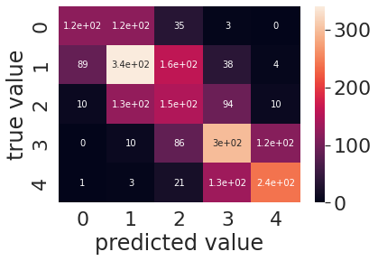

# MovieComment-classification

對電影評論做情緒分析

## Project Description

利用GLUE (General Language Understanding Evaluation)中的SST datset 訓練模型

再透過爬蟲，對PTT movie版的電影評論做情緒分析

## Data

SST(The Stanford Sentiment Treebank)，是斯坦福大學發布的一個情感分析數據集，主要針對電影評論來做情感分類，因此SST屬於單個句子的文本分類任務(其中SST-2是二分類，SST-5是五分類，SST-5的情感極性區分的更細緻)

https://nlp.stanford.edu/sentiment/index.html

 ## Data Description

 **SST classification.ipynb**
 
 [](https://colab.research.google.com/drive/1_aisVzODqsm1OSswfsRA4WJuthccxjMb?usp=sharing)

 ### 五分類

    0 negative
    1 somewhat negative
    2 neutral
    3 somewhat positive
    4 positive

 ### Dataset 數量
 
 train data target分布

    0: 1092, 1: 2218, 2: 1624, 3: 2322, 4: 1288
    
test data target分布

    0: 139, 1: 289, 2: 229, 3: 279, 4: 165

example (後面數字為target)

    The Rock is destined to be the 21st Century 's new `` Conan '' and that he 's going to make a splash even greater than Arnold Schwarzenegger , Jean-Claud Van Damme or Steven Segal .   3

    The gorgeously elaborate continuation of `` The Lord of the Rings '' trilogy is so huge that a column of words can not adequately describe co-writer/director Peter Jackson 's expanded vision of J.R.R. Tolkien 's Middle-earth .   4


## Training

 **use bert-base-uncased model**


```python
from transformers import BertTokenizerFast
tokenizer = BertTokenizerFast.from_pretrained('bert-base-uncased')
train_encodings = tokenizer(train_context, truncation=True, padding=True)
val_encodings = tokenizer(val_context, truncation=True, padding=True)
 ```

將 input 資料轉換成 token id 、type_id 與 attention_mask

### 定義 Dataset，並轉換成 tensor 格式

```python
 class Dataset(torch.utils.data.Dataset):
  def __init__(self, encodings):
    self.encodings = encodings

  def __getitem__(self, idx):
    return {key: torch.tensor(val[idx]) for key, val in self.encodings.items()}

  def __len__(self):
    return len(self.encodings.input_ids)
 ```

### Setting model 
    
    from transformers import BertConfig, BertForSequenceClassification
    config = BertConfig.from_pretrained('bert-base-uncased', num_labels=5)
    model = BertForSequenceClassification.from_pretrained('bert-base-uncased', config=config)

### Batch, Epochs

```python
train_batch_size = 40     
eval_batch_size = 20   
num_train_epochs = 10
```

### learning rate

```python
learning_rate=2e-5 
```

## Result

    {'accuracy': 0.5199095022624435}
    {'precision': 0.5283036335013107}
    {'recall': 0.5199095022624435}
    {'f1': 0.5222431012093874}

### Confusion matrix



## Demo

    the movie is suck
    prediction : 1 (somewhat negative)

從爛番茄網站抓猛毒2的消費者影評:

    reat flick but too short. --------> 1 : somewhat negative
    There was too much forced comedy without enough actual plot to actually be good. --------> 3 : somewhat positive
    This movie was amazing I wish it was longer --------> 2 : neutral
    Trash. --------> 2 : neutral
    Exciting and thrilling to watch. --------> 2 : neutral
    They’re definitely trying to bring venom into the MCU I think that’s amazing! --------> 2 : neutral
    Good followup from the first film, Hed a few issues. but overall entertaining. --------> 2 : neutral
    Very entertaining! Great action, good storyline. --------> 3 : somewhat positive
